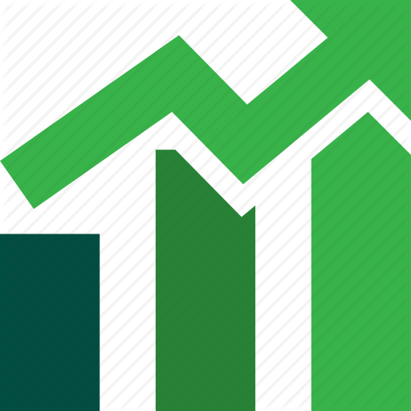

<!--
*** Thanks for checking out the Best-README-Template. If you have a suggestion
*** that would make this better, please fork the repo and create a pull request
*** or simply open an issue with the tag "enhancement".
*** Thanks again! Now go create something AMAZING! :D
-->


<!-- PROJECT SHIELDS -->
<!--
*** I'm using markdown "reference style" links for readability.
*** Reference links are enclosed in brackets [ ] instead of parentheses ( ).
*** See the bottom of this document for the declaration of the reference variables
*** for contributors-url, forks-url, etc. This is an optional, concise syntax you may use.
*** https://www.markdownguide.org/basic-syntax/#reference-style-links
-->
<a href="https://join.robinhood.com/yangtaf"><strong>To thank me, use my robinhood referral link. We'll both get a free stock</strong></a>


<!-- PROJECT LOGO -->
<br />
<p align="center">
  <a href="https://github.com/othneildrew/Best-README-Template">
    
  </a>

  <h3 align="center">Rain's Guide to Investing</h3>

  <p align="center">
    A Guide to Picking the Correct Investment Strategy For you
  </p>
  <br />
</p>


<!-- TABLE OF CONTENTS -->
<details open="open">
  <summary>Table of Contents</summary>
  <ol>
    <li>
      <a href="#overview">Overview</a>
    </li>
    <li>
      <a href="#retirement-investing">Retirement Investing</a>
      <ul>
        <li><a href="#401k">401k</a></li>
        <li><a href="#ira">IRA</a></li>
        <li><a href="#traditional-or-roth">Traditional or Roth</a></li>
        <li><a href="#hsa">HSA</a></li>
      </ul>
    </li>
    <li>
      <a href="#taxable-investing">Retirement Investing</a>
      <ul>
        <li><a href="#passive-investing">Passive Investing</a></li>
        <li>
          <a href="#active-investing-with-minimal-checking">Active Investing With Minimal Checking</a>
          <ul>
            <li><a href="#asset-allocation">Asset Allocation</a></li>
            <li><a href="#stock-picking-to-hold">Stock Picking To Hold</a></li>
          </ul>
        </li>
        <li><a href="#active-investing-with-daily-checking">Active Investing With Daily Checking</a></li>
      </ul>
    </li>
    <li>
      <a href="#fsa">FSA</a>
    </li>
    <li><a href="#contact">Contact</a></li>
    <li><a href="#acknowledgements">Acknowledgements</a></li>
  </ol>
</details>


<!-- OVERVIEW -->
## Overview

<details open="open">
  <summary>Overview</summary>

  <br />
  <a href="#retirement-investing">Retirement Investing</a> is by far the most efficient way to invest. The downside is that the money is best left untouched until age 55/59.5. This will cover various kinds of retirement investment accounts.

  <br />
  <br />
  <a href="#taxable-investing">Taxable Investing</a> is the most varied of investing. Money goes here if:

  * Your timetable for withdrawing money is before retirement age
  * You already maxed out your retirement accounts

  This section will cover various strategies for taxable investing.

  <br />
  <br />
  <a href="#fsa">FSA</a> is a way to avoid paying income tax on money spent on many everyday items, such as diapers and condoms.
</details>


<!-- RETIREMENT INVESTING -->
## Retirement Investing

<details open="open">
  <summary>Retirement Investing</summary>

### 401k

<details open="open">
  <summary>401k</summary>

  <br />

  * For those who want their money on autopilot
  * Only available through your employer
  * $19,500 annual contribution limit for 2021
  * Don't forget to rollover your previous employer's 401k into your new 401k or IRA. The last thing you want to do is to withdraw from 10 different 401k accounts when you retire
  * Can only buy mutual funds. Can't buy stocks or ETFs unless you do a backdoor IRA. For a mutual fund, the safest route is to pick a Retirement Fund in the decade you plan to retire. More on how retirement funds work <a href="#asset-allocation">here</a>.
  * Mutual funds can be cheaper through your 401k than through your IRA

  ```yaml
  <-- Picking a Mutual Fund Example

  You plan to retire in 2050. Go with a mutual fund that looks like "Retirement Fund 2050".
  If you are retiring in 2055, then you could go with 2050 if you want to be safer,
   or 2060 if you want to be greedier and riskier.

  ```

</details>

### IRA

<details open="open">
  <summary>IRA</summary>

  <br />

  * For those who want a more hands-on approach to their investing
  * $6,000 annual contribution limit for 2021 ($7,000 if you're 50 or older)
  * You can bypass the annual contribution limit by depositing money into the IRA directly from your 401k (rollover). This process is known as a "backdoor IRA". This is especially useful if you wanted to invest in stocks with your 401k money
  * The annual contribution limit is lower if you make more than $125,000/$198,000 single/married. You can't contribute at all if you make more than $140,000/$208,000
  * Can buy stocks, ETFs, mutual funds, bonds, CDs, and more
  * You can sell & buy stocks without incurring any capital gains tax in the account. This makes IRAs EXTREMELY powerful for those who continually buy & sell stocks & ETFs
  * Some recommended IRA providers: Ameritrade and Fidelity (especially if your 401k is with them). These providers do not have any trading fees, no matter what. If your 401k is already with Fidelity, doing a backdoor IRA does not incur a fee if your IRA is also with Fidelity
</details>

### Traditional or Roth

<details open="open">
  <summary>Traditional or Roth</summary>

  <br />
  Both 401ks and IRAs come in 2 versions, traditional and roth. If you can max out all your retirement accounts, then you should be using a roth, and convert all your traditional retirement accounts into roth. Converting a traditional account to roth means you'll pay income tax on the amount converted. You can convert in phases if you can't afford the income tax of the full conversion at once.

  * Note that a traditional 401k/IRA has RMD, Required Minimum Distribution. This means that at the age of 72, you must liquidate the whole account within 10 years. Thus, if you have a large balance, you will skyrocket in tax bracket. If someone else inherits your account, they will also be subject to RMD. Roth has no such restrictions.

  Below I will illustrate the differences between Traditional and Roth accounts with some examples. Here are the assumptions we will make across both examples:
  * You contribute $20,000 per year for 30 years. $600,000 total contributions
  * +8.5% return per year
  * Final balance after 30 years is $2.4 million

  ```yaml
  <-- Traditional 401ks/IRAs Example

  By the end of the 30 years, you will have avoided ~$200,000 in income taxes during your career.
  You will pay ~$800,000 in income taxes on the account when you retire.

  Net taxes paid = ~$600,000

  ```


  ```yaml
  <-- Roth 401ks/IRAs Example

  By the end of the 30 years, you will have paid ~$200,000 in income taxes during your career from contributions.
  You will avoid paying ~$800,000 in income taxes on the account when you retire.

  Net taxes paid = ~$200,000

  ```

  Keep in mind if you have a good strategy with stocks & ETFs, you will likely see returns far greater than 8.5%. This would mean you would pay even more in income tax if this was in your traditional IRA.
</details>

### HSA

<details open="open">
  <summary>HSA</summary>

  <br />
  If your health plan comes with an HSA, I strongly recommend you max it out. Best to see an HSA as an investment vehicle, rather than an account for medical expenses. HSA is more powerful than a traditional 401k, and should be treated as a secondary 401k. This would mean your emergency budget should be increased to account for your health plan deductible.

  * Only available if your health plan comes with it
  * $3,600 annual contribution limit for 2021 ($4,600 if you're 55 or older, $7,200 if you have family coverage with the plan)
  * It is taxed like a traditional 401k, except there is no taxes or penalty at any point for withdrawals for medical expenses
  * No RMD

  ```yaml
  <-- HSA example

  Assumptions:
  * You contribute $3,600 per year for 30 years. $108,000 total contributions
  * +8.5% return per year
  * Final balance after 30 years is ~$400,000

  You avoid ~$30,000 in income taxes over 30 years.

  If you withdraw:
  * No income tax before or after retirement for medical expenses
  * Before retirement, income tax + penalty for any other reason
  * After retirement, just income tax for any other reason

  ```
</details>
</details>


<!-- TAXABLE INVESTING -->
## Taxable Investing

<details open="open">
  <summary>Taxable Investing</summary>

  <br />

  There are 3 main approaches I recommend, depending on how much time you can spend managing your portfolio

### Passive Investing

<details open="open">
  <summary>Passive Investing</summary>

  <br />

  This strategy is great if you:

  * Don't ever want to check your portfolio
  * Have a timeline of at least a few years

  I would buy either [SP500][spy-url] or [NASDAQ][qqq-url]. Comparison below:
  ```yaml
  <-- S&P 500 (SPY, VOO)

  SP500 is the top 500 US companies by valuation. They are represented by the ETFs SPY and VOO.
  There are other SP500 ETFs, but they all move the same. They're all ETFs of the same 500 companies.

  * When people talk about "the market", this is what they mean
  * SP500 is diversified, and includes a wide range of companies and sectors from tech, to medical
  * When one company in the SP500 slips out, another will be promoted in
  * It’s been going up long term for over 100 years
  * Buying SP500 is essentially a vote of confidence for the American Economy

  ```
  
  ```yaml
  <-- NASDAQ 100 (QQQ)

  NASDAQ 100 is the top 100 North-American non-financial firms, by valuation.
  They are represented by the ETF QQQ.

  * Currently, NASDAQ is very "tech-heavy"
  * It is less diversified than the SP500, but it's been out-performing the SP500 for over 10 years
  * Just like the SP500, it will reevaluate once a year and adjust holdings based on
   current valuations

  ```
</details>

### Active Investing With Minimal Checking

<details open="open">
  <summary>Active Investing With Minimal Checking</summary>

  <br />

  This is for you if you want more returns in exchange for checking your portfolio periodically or following the companies that you have stocks with


#### Asset Allocation

<details open="open">
  <summary>Asset Allocation</summary>

  <br />

  This is the strategy that financial advisors and retirement funds in your 401k, IRA, and HSA are using.
  
  At a high-level, Asset Allocation is when you decide each asset (stocks, ETFs, cash, real estate, etc) will occupy a set percentage of your overall portfolio. When an asset rises or falls below the percentage you set, you will sell & buy until all assets are as close to your original designated percentages as possible. This is known as "rebalancing". A common used threshold to trigger rebalancing is 5%. This threshold is called "deviation percentage".

  * 50% stocks, 50% bonds is a common Asset Allocation used by financial advisors, for those with a long timeline
  * If you choose to let a financial advisor or mutual fund to manage it for you, they will charge you a percentage of the portfolio every year to manage it for you. Even if they lose you money, they will still collect the "management fee". Financial advisors commonly charge 1% per year.

  ```yaml
  <-- Asset Allocation Example

  Assumptions:
  * 50% stocks (QQQ), 50% bonds (BND)
  * Bonds value will remain unchanged. This is mostly true. The most the bond ETF BND changed
   was less than 10% during the covid recession
  * Deviation percentage set to 5%.  This means we won't rebalance until we see an asset
   reach 55%+, or fall 45%-
  
  Timeline:
  * You invest $100. $50 of it goes into QQQ. $50 goes into bonds
  * QQQ drops 2%. You now have $49 of QQQ, and $50 in BND. 49/99 = 49% > 45%. Don’t rebalance
  * 1 month later, QQQ drops 30% during the covid recession. Your portfolio is now $35 QQQ, $50 in BND.
   (35/85 = 41% < 45%). Rebalance. Sell some BND, buy some QQQ, until you’re back to an even
   50-50 split ($42.50 QQQ- $42.50 BND)
  * 2 months later, QQQ recovers back to the original price. You now have $60.71 in QQQ, $42.50 in BND.
   Your portfolio is now at $103.21, even though QQQ is at the same price as when you first started.
   You’re up 3.21%!
   But QQQ is now 59% of your portfolio (60.71 / 103.21). You should now rebalance and lock in your
    gains. You will end up with $51.60 QQQ - $51.60 BND
  
  This example used the real covid & QQQ percentages & timeline. 7 months after QQQ recovered from the
   covid recession, QQQ is now 35% higher than the original price at the start of this example.
  
  If you're too lazy to do basic math, most trading apps/sites will give you a pie-chart with
   percentages and numbers. So you can just check that pie-chart for when you need to rebalance.

  ```

  Retirement Funds use Asset Allocation, but with a twist.
  * If the Retirement Mutual Fund is 30 years out, the asset allocation will be around 60% stocks, 40% bonds
  * As time goes on, the percentage of bonds will go up
  * By the time the Retirement Mutual Fund's target year has arrived, the fund is close to 100% bonds
  * It is designed this way so that if the market crashes the year you retire, most of your money there is protected

  Below are some examples of different asset allocations you can choose:
  ```yaml
  <-- Examples of Asset Allocations

  * 50% SPY - 50% cash
  * 25% SPY - 25% QQQ - 50% gold
  * 10% GOOG - 10% AAPL - 10% NFLX - 10% TSLA - 10% AMZN - 50% BND
  * 25% QQQ - 15% AMZN - 10% bitcoin - 10% BND - 10% cash - 30% real estate (the value of your investment properties)
  ```
</details>

#### Stock Picking To Hold

<details open="open">
  <summary>Stock Picking To Hold</summary>

  <br />

  If you want to buy stocks for individual companies, without checking on them, you'll need a few things:

  * Appetite for risk. Stocks are more volatiles than ETFs. A stock can drop as much as 15% in a day. Can you stomach that? 
  * Do not buy a stock because of hype. Spend a lot of time vetting the company. Professional investors will track hundreds of companies, but will only hold around 7 stocks at a time. That is the level of research you must do

  ```yaml
  You must do thorough research yourself on a stock you wish to buy

  Ask yourself:
  * What does this company's financials look like?
  * What is the financial breakdown of the company?
  * Who are all the competitors to the company, in every revenue source?
  * Is the sector/s this company belongs to doing well or dying?
  * Is this company profitable?
  * Do they have outstanding debts?
  * When are their debts due?
  * Is this IPO day? Never buy shares on IPO day
  * etc
  ```

  Before I close this section, I want to share some of my failure stories regarding the importance of some of the above questions.
  
  ```
  What is the financial breakdown of the company?
  ```
  When Disney ([DIS][dis-url]) announced they were making Disney+, I waited for a Disney stock dip and bought some shares. I did research, but not enough. My research showed that Disney owned over 50% of the global box office, and I predicted that Disney+ would shred Netflix's market share. When Disney+ launched, my Disney shares were up. I made +15% net total on my Disney shares!

  But the problem was the market (SP500/SPY) was up 25% during that whole time I had Disney shares. When I looked at Disney's financial breakdown, only 10% of their revenue was in home media. Majority of their revenue was from theme parks and in-theater movie showings.

  Even though I did do research, and bought Disney at a discount, I didn't beat the market.

  Do your research thoroughly

  ```
  Is this IPO day? \\ Is this company profitable? \\ Who are the competitors?
  ```
  When Slack ([WORK][work-url]) went public, I bought shares because every job I've had has used Slack, and I enjoy using their product. I bought shares on IPO day. This was my first mistake. Shares almost always slide in price over the next few weeks after IPO, as hype dies down. If a company you're excited for IPOs, track it, and wait a few days. You'll almost always get a discounted price if you wait a few days or weeks.

  Second mistake I made, I didn't check the company's profitability. Slack was heavily in debt, and very much negative cash flow. Their shares lost half their value since IPO in a matter of a few months.

  Third mistake I made, I didn't check their competitors. Slack's competitor was Microsoft's Team. But Microsoft has much deeper penetration in the enterprise communication market due to their long history with several big companies and organizations (like the federal government)

  Even though I was familiar with their product and believed in it, I lost money on Slack.

  Do your research thoroughly

  ```
  Is this company profitable? \\ Do they have any outstanding debts? \\ When are their debts due?
  ```
  In Janury 2018, Tesla ([TSLA][tsla-url]) was one of the hottest stocks. But if you had bought TSLA at this time, by May 2019, you would've lost half the money you put in.

  Why?

  * Tesla was not profitable
  * Tesla had been taking loans for over 7 years
  * In January 2018, those debts were being called in by Tesla's creditors

  Do your research thoroughly

  ```
  You can't hold onto a stock forever, hoping for the best
  ```
  In 2000, General Electric ([GE][ge-url]) was one of the 10 most valuable companies in the USA. It was one of the original 12 stocks that formed the Dow Jones Industrial Average, back in 1896. In 2018, GE was removed from the Dow, after losing over 80% of it's valuation in less than 2 decades.

  You can't blindly buy a stock, even if it's a "safe stock", and think decades from now, it'll be worth more. Every stock you buy for the long term must be thoroughly vetted.

  Do your research thoroughly
</details>
</details>


### Active Investing With Daily Checking

<details open="open">
  <summary>Active Investing With Daily Checking</summary>

  <br />

  TODO
</details>
</details>


<!-- FSA -->
## FSA

<details open="open">
  <summary>FSA</summary>

  <br />
  FSA is an account for health related expenses. Unlike the HSA, though, you can't invest it and you will lose money at the end of the year if you don't use it.

  * Only available if your employer offers it
  * $2,750 annual contribution limit for 2021. You will not pay income tax on contributions, like a traditional 401k or HSA
  * $550 will rollover for 2021. What that means is any amount over $550 in the FSA by the end of the year will be lost
  * Your company may have a grace period of up to 2.5 months. This means that for up to 2.5 months after the year you made FSA contributions, you can still spend the FSA money that didn't rollover

  ```yaml
  <-- Example of an FSA grace period

  Your baby due date is December 2021, so you put money into your FSA to cover the deductible/copay.
  Your baby ended up coming in January 2022. If your company has a grace period,
   that means that you can still use your 2021 FSA to cover the baby delivery.

  ```
  * Can't withdraw the money as cash. Every expense needs a receipt, submitted to your employer's FSA provider
  * Can be used on a wide range of items, including:
  ```yaml
  Copays & Deductibles
  Prescription medication
  Insulin
  Female hygiene products (such as pads)
  Nursing supplies (including diapers)
  Condoms & prescribed birth control
  Lasik & PRK
  A whole lot of others. Just google whatever you’re curious about
  ```

</details>


<!-- CONTACT -->
## Contact

Rain Fang (Yu-Chieh) - YCFang87@gmail.com
<br />
214-228-4236
<br />
<br />
[![LinkedIn][linkedin-shield]][linkedin-url]


<!-- ACKNOWLEDGEMENTS -->
## Acknowledgements
* [My Investing Study Buddy - Jason Tsay][jason-url]
* [Othneil Drew's Readme Example](https://github.com/othneildrew/Best-README-Template)


<!-- MARKDOWN LINKS & IMAGES -->
<!-- https://www.markdownguide.org/basic-syntax/#reference-style-links -->
[rh-ref-url]: https://join.robinhood.com/yangtaf
[img-Intraday-Volatility]: images/Intraday-Volatility.png
[img-Webull-wma-rsi]: images/Webull-wma-rsi.png
[linkedin-url]: https://www.linkedin.com/in/rain-fang
[linkedin-shield]: https://img.shields.io/badge/-LinkedIn-black.svg?style=for-the-badge&logo=linkedin&colorB=555
[jason-url]: http://www.jsntsay.com/
[spy-url]: https://www.google.com/search?q=SPY&rlz=1C1CHBF_enUS746US746&oq=SPY&aqs=chrome..69i57j0i271l3j69i60.507j0j1&sourceid=chrome&ie=UTF-8
[qqq-url]: https://www.google.com/search?q=QQQ&rlz=1C1CHBF_enUS746US746&oq=QQQ&aqs=chrome..69i57j69i59l3j69i60l3j69i65.581j0j1&sourceid=chrome&ie=UTF-8
[dis-url]: https://www.google.com/search?q=DIS&oq=DIS&aqs=chrome..69i57j0i271l3j69i60j69i61.647j0j1&sourceid=chrome&ie=UTF-8
[work-url]: https://www.google.com/search?q=WORK+stock&oq=WORK+stock&aqs=chrome..69i57j0i271.1903j0j9&sourceid=chrome&ie=UTF-8
[tsla-url]: https://www.google.com/search?q=TSLA&oq=TSLA&aqs=chrome..69i57j0i271l3j69i60l3.9649j0j9&sourceid=chrome&ie=UTF-8
[ge-url]: https://www.google.com/search?q=ge+stock&oq=GE+stock&aqs=chrome.0.69i59j0i271j69i60.1326j0j1&sourceid=chrome&ie=UTF-8